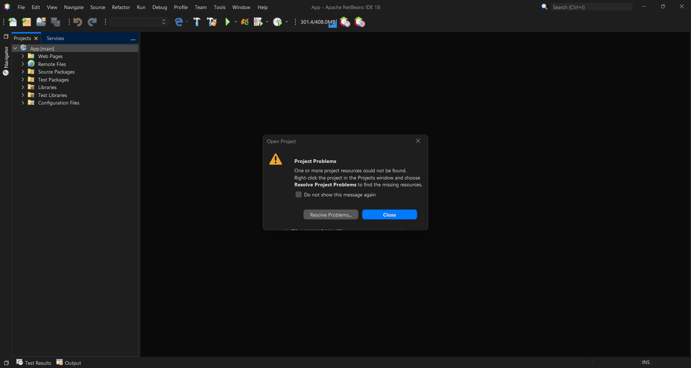
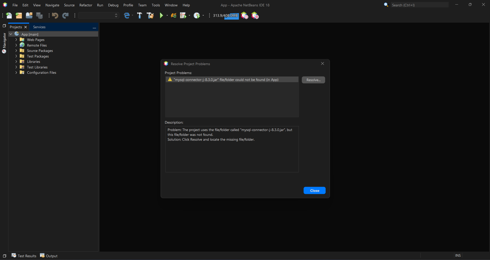
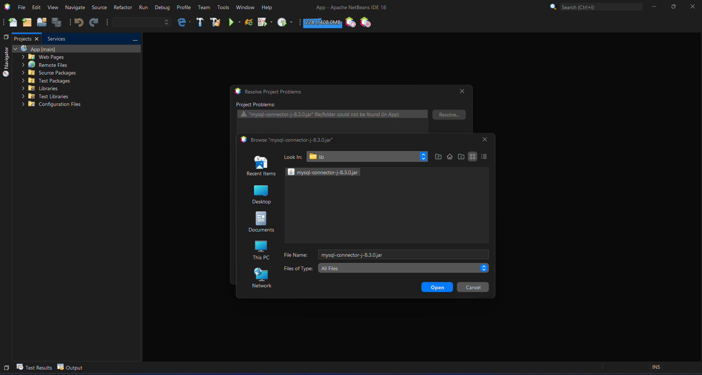
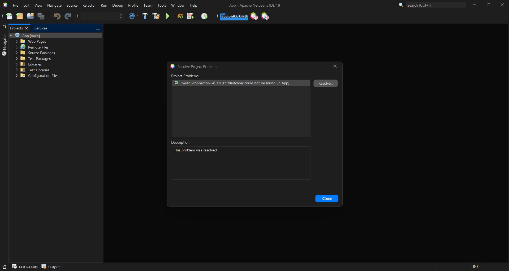
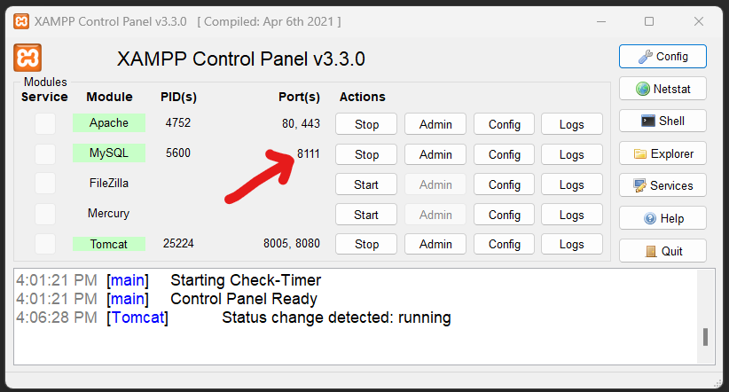
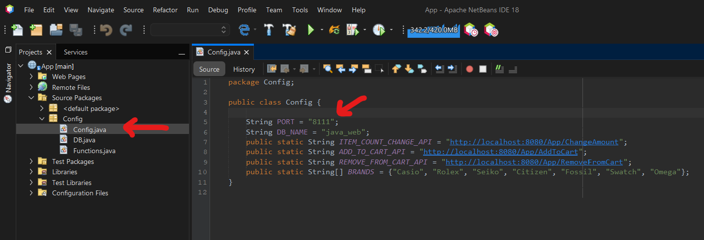
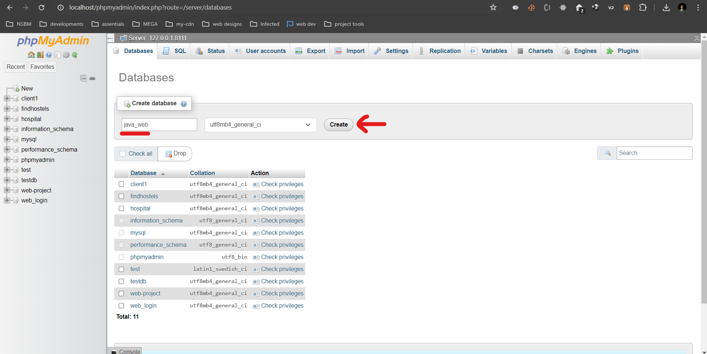
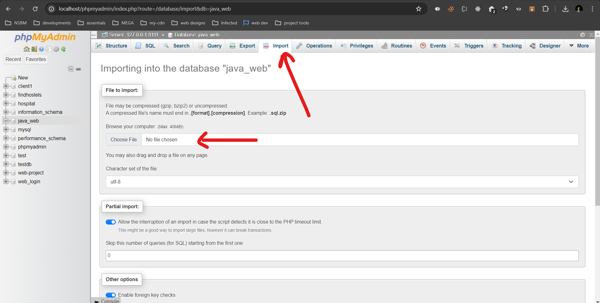
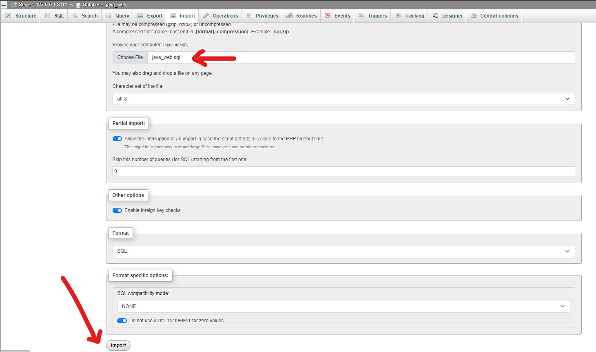
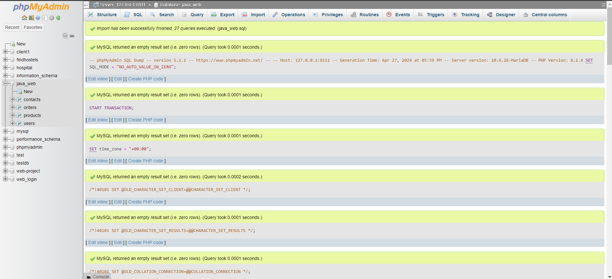

<div align="center">
  
  
  
  
  
  
  
</div>
<div align="center">
  
  
</div>
<br>
## Table of Contents

- [Project Setup Instructions](#project-setup-instructions)
- [Features](#features)
- [Future Implementation](#future-implementation)
- [Issues](#issues)
- [Fixed Issues](#fixed-issues)
- [To-Dos](#to-dos)
- [Developer Contributions](#developer-contributions)
- [Group Members](#group-members)

# Project Setup Instructions

Follow these steps to set up the project:

1. **Clone the Repository:**

```sh
git clone https://github.com/upekshaip/jsp-web-project.git
```

2. **Open the Project with Apache NetBeans:**
   Open the project using Apache NetBeans IDE.

3. **Resolve Dependencies:**

- Click Resolve Problems
  
- Sellect the error and click Resolve...
  

- Add the JDBC connector for the project. Navigate to the `App` folder and locate the `web` folder. Set the JDBC connector path to `App/web/WEB-INF/lib/mysql-connector-j-8.3.0.jar`.

- Click `mysql-connector-j-8.3.0.jar` and click Open
  
- Now it should be okey. Then close
  

4. **Configure Tomcat Server (if not added):**
   If Tomcat server is not added, include its path (commonly `C:\xampp\tomcat`).

5. **Change Database Port Number:**

- If you open XAMPP, start MySQL, and find the port number displayed.
  
- In the `Source` package, navigate to the `Config` package and open `Config.java` class file.
- Open the Config.java class file located in the Source package > Config package.
- Locate the line `String PORT = "3306";` and replace "3306" with the port number you found.
  

6. **Database Setup:**

- Access `localhost/phpmyadmin` and create a new database named `java_web`.
  
- Select the `java_web` database and navigate to the import section.
  
- Import the `java_web.sql` file and save, ensuring all database tables are imported.
  
  

7. **Run the Application:**
   Run your application after completing the above steps.

# Features

1. **User Authentication**: Users can sign up and log in to the platform to access features like purchasing products and viewing order history.
2. **Product Browsing**: Users can browse through a wide range of wristwatches, viewing details such as prices, features, and images.
3. **Shopping Cart Management**: Users can add items to their cart, adjust quantities, and remove items as needed before proceeding to checkout.
4. **Order Management**: Users can place orders and view the status of their orders, including details like discounts, original price, purchased price, and timestamps.
5. **Admin Panel**: Administrators have access to a panel where they can manage orders, products, users, and update order statuses.

# Future Implementation

1. **Payment Gateway Integration**: Implement a payment gateway to enable secure online transactions.
2. **Advanced Search and Filter Options**: Enhance product browsing experience with advanced search and filter functionalities.
3. **User Reviews and Ratings**: Allow users to leave reviews and ratings for products, enhancing trust and aiding other users in their purchasing decisions.
4. **Responsive Design**: Ensure the website is fully responsive across various devices for a seamless user experience.
5. **Analytics Dashboard**: Develop an analytics dashboard for administrators to track sales, user engagement, and other key metrics.
6. **Payment Gateway Integration**: Integrate a payment gateway to enable secure online transactions.
7. **Advanced Search and Filter Options**: Enhance product browsing experience with advanced search and filter functionalities.
8. **User Reviews and Ratings**: Allow users to leave reviews and ratings for products, enhancing trust and aiding other users in their purchasing decisions.
9. **Analytics Dashboard**: Develop an analytics dashboard for administrators to track sales, user engagement, and other key metrics.
10. **Offline Mode**: Enable offline mode functionality to allow users to browse products and add items to their cart even when they're not connected to the internet, syncing data once connectivity is restored.
11. **Customization Options**: Offer customization options for wristwatches, allowing users to choose materials, colors, and engravings to create personalized products.

# Issues

- Note that all the issues are on the issues tab. Go there to see them 😇

1. **UI/UX Improvements**: Enhance the user interface and experience to make navigation and interaction more intuitive.
2. **Performance Optimization**: Address any performance bottlenecks to ensure smooth operation, especially during high traffic periods.
3. **Security Enhancements**: Implement additional security measures to protect user data and prevent unauthorized access.
4. **Bug Fixes**: Address any reported bugs or issues to improve overall stability and functionality.

# Fixed Issues

- Note that all the issues are on the issues tab. Go there to see them 😇

1. **Database Connection Error**: Resolved issues related to database connectivity and configuration.
2. **UI Rendering Bugs**: Fixed various bugs related to UI rendering and responsiveness.
3. **Authentication Issues**: Addressed issues with user authentication and session management.
4. **Order Processing Errors**: Fixed bugs affecting order processing and status updates.

# To-Dos

1. **Refactor Code**: Implement code refactoring to improve code quality, maintainability, and scalability.
2. **Documentation Update**: Ensure documentation is up to date with any changes or new features implemented.
3. **Testing**: Conduct thorough testing to identify and fix any remaining bugs or issues.
4. **Continuous Integration/Deployment**: Set up CI/CD pipelines for automated testing and deployment.
5. **Feedback Integration**: Integrate user feedback mechanisms to gather insights for further improvements.

# Developer Contributions

Frontend and backend developers are invited to contribute to the project in the following areas:

- **Frontend Development**:

  - Implement responsive design using HTML, CSS, and JavaScript.
  - Enhance user interface elements for improved usability and aesthetics.
  - Integrate client-side validation and error handling for forms and interactions.

- **Backend Development**:
  - Improve server-side functionality using Java and Servlets.
  - Optimize database queries and transactions for better performance.
  - Implement new features and functionalities according to project requirements.

Contributions will be managed through GitHub pull requests following the project's contribution guidelines.

# Group Members

<table style="width:100%">
  <tr>
    <th>Student ID</th>
    <th>Name</th>
    <th>GitHub Username</th>
  </tr>
  <tr>
    <td>27292</td>
    <td>GUI Perera (Group Leader)</td>
    <td><a href="https://github.com/upekshaip">@upekshaip</a></td>
  </tr>
  <tr>
    <td>27601</td>
    <td>SWKR Pinsiri</td>
    <td><a href="https://github.com/Kavindu-R">@Kavindu-R</a></td>
  </tr>
  <tr>
    <td>27578</td>
    <td>MJM Shaahid</td>
    <td><a href="https://github.com/MShaahid">@MShaahid</a></td>
  </tr>
  <tr>
    <td>27958</td>
    <td>MCA Jayasingha</td>
    <td><a href="https://github.com/ChethakaJayasingha">@ChethakaJayasingha</a></td>
  </tr>
  <tr>
    <td>26961</td>
    <td>JKS Senevirathna</td>
    <td><a href="https://github.com/Shyaminda">@Shyaminda</a></td>
  </tr>
</table>
